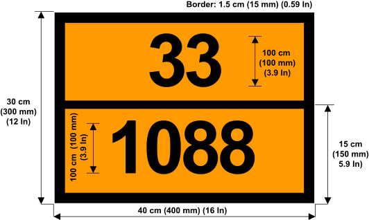

## Introduction

Welcome to M³ ADR Technical documentation

The goal of the ADR module is to put together the ADR plate recognitions coming from cameras.

The module works with two cameras that must recognize the orange plate on each ADR transporter:

{:refdef: style="text-align: center;"}
[{:height="250px"}](assets/ADR_dimensions.svg "ADR plate dimensions"){:target="_blank"}
{:refdef}

Near this orange plate, another plate can be found indicating the type of danger with a pictogram in a diamond shape :

- Old version: Black pictogram on an orange background
- TMD version: Black or white pictogram on top, eventually a number or additional information on the bottom, on a multicolor background
- New version: Black pictogram on a white background with a red border

The purpose of the detection is to control a segment of road, detectING each ADR vehicle entering the segment, count them (parking) and deduce the content from the codes on the plate.

*With future updates, M³ should be able to manage how many vehicles can enter this segment (depending of the maximum GWH) and display a message on a VMS to limit the entrance (VMS Scenario).*

## Functionalities

### Camera

- Detect transporter plate → ANPR
- Detect ADR plate
  - Orange plate on each side of the vehicle
  - Detect the content of the vehicle → Can be empty

### Detection

- Two equipments (cameras) in an **ADR group**
  - These cameras need to  detect each vehicle with an **ADR orange plate** and a **plate number**
    - Orange plates are rectangular with a horizontal line separating the top half from the bottom half. Plates can contain:
      - Number → Top = danger code / Bottom = material code)
      - Empty → Vehicle could be empty but not clean OR Vehicle with multiple materials
      - Crossed → Empty vehicle and clean OR degassed
  - Count the number of ADR vehicles currently on the road, between both cameras (parking)
    - A vehicle plate is saved for a limited amount of time (48h for parking, maybe less for ADR)
  - With the plate number and the fact that the transporter is an ADR, we can get the GWH for each transporter
    - With this data we can calculate a threshold
- VMS to display message before the first camera
  - Can display data:
    - if the threshold is exceeded → STOP message for ADR transporter
    - else → GO message for ADR transporter
